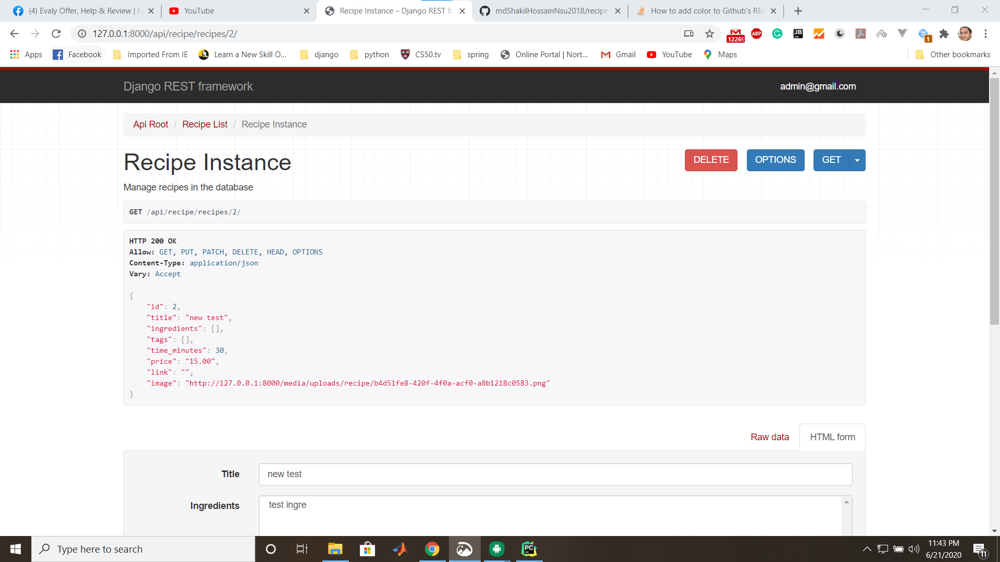
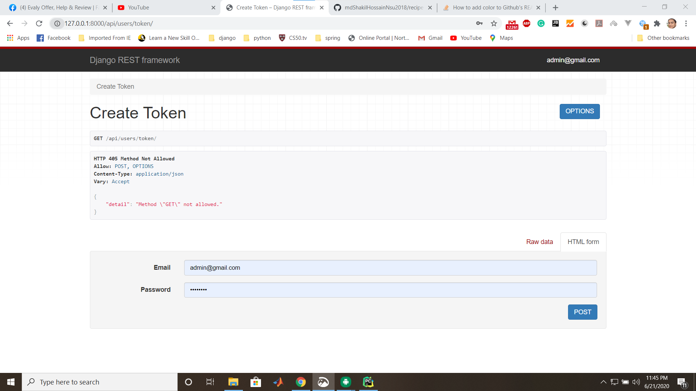
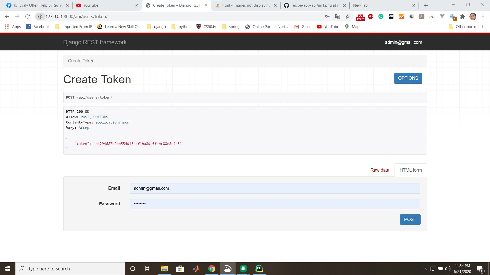

# recipe-app-api
This is recipe app using django best practice backend api with test driven development.

### Requirements

>Django>=2.1.3, <3.0.7
>
>djangorestframework>=3.11.0, <3.12.0
>
>psycopg2>2.7.5 , <2.8.0
>
>coreapi==2.3.3
>
>Pillow>=5.3.0 , <5.4.0

## some ss below

</img>
</img>
</img>